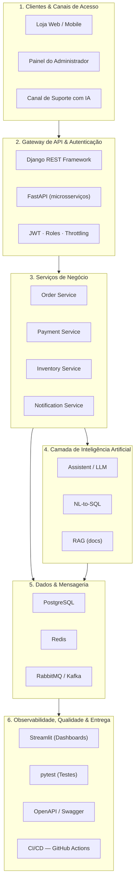

# SynapseShop — Backend de Pedidos com Inteligência Artificial


> Projeto desenvolvido no contexto da **SynapseTech** — empresa simulada do curso de
> **Programação Python Avançada com IA** (100 horas · 25 aulas).

---

## 1. Sobre o Projeto

O **SynapseShop** é o backend de uma loja online voltado à gestão de produtos, pedidos,
pagamentos simulados e notificações. Sobre essa base transacional robusta, opera uma camada
inteligente responsável por três pilares de IA:

1. **Assistente de Suporte (`/assist`)** — responde dúvidas de clientes sobre pedidos e status
   usando um serviço de IA resiliente (com *retry* e *circuit breaker*).
2. **Consulta em Linguagem Natural (`/ask_sql`)** — converte perguntas em texto corrido
   (ex.: *"quais os produtos mais vendidos este mês?"*) em consultas SQL dinâmicas.
3. **Assistente de Documentação via RAG (`/ask_docs`)** — responde com base no próprio `README`
   e na documentação técnica da API, com citação rigorosa das fontes.

O desenvolvimento segue a metodologia **SpecDD (Specification-Driven Development)**, de forma
incremental, a partir das especificações registradas em [`specs/`](specs/).

---

## 2. Equipe

| Papel | Atribuições |
| :--- | :--- |
| **Tech Lead & Product Owner** | Conduz a formação do time, define o domínio do projeto e garante o entendimento unificado da arquitetura-alvo. |
| **DevOps / SRE** | Cria e configura o repositório no GitHub, garantindo acesso e permissão de contribuição a todos os membros. |
| **Arquiteto(a)** | Planeja a arquitetura em camadas e a estrutura inicial da documentação. |
| **Desenvolvedor(a)** | Implementa o código do MVP em camadas lógicas (API, Serviços e Repositórios). |
| **Especialista em IA** | Desenha e integra os serviços de IA (assistente, texto-para-SQL e RAG). |

### Integrantes

1. Alan Correa
2. Amanda Gomes
3. Alvaro Luiz
4. Gustavo Lima
5. Ricardo Reis
6. Hiram Simoes
7. Caio Barbosa

---

## 3. Domínio da Loja

**Eletrônicos** — e-commerce de produtos eletrônicos (categorias, catálogo e gestão de pedidos),
mantendo aderência total aos requisitos técnicos obrigatórios do MVP.

---

## 4. MVP — Descrição

Backend containerizado de uma loja de **eletrônicos** com gestão de produtos, pedidos, pagamentos
simulados e notificações, exposto por APIs (Django REST Framework + FastAPI) com autenticação JWT
baseada em papéis. O MVP integra, na camada de IA, pelo menos uma das funcionalidades inteligentes
(assistente de suporte, texto-para-SQL ou RAG) e opera com mensageria assíncrona, cache e testes
automatizados.

**Critérios de conclusão (DoD global):**
- Subir o ambiente completo com um único comando: `docker-compose up`.
- Autenticação JWT com pelo menos dois papéis de usuário.
- Fluxo ponta a ponta `Pedido ➔ Pagamento ➔ Notificação` com mensageria, idempotência e DLQ.
- Testes automatizados dentro da meta da turma e documentação OpenAPI/Swagger.
- Pelo menos uma funcionalidade de IA operacional.
- Pipeline de CI/CD (GitHub Actions) e dashboard analítico (Streamlit).
- Documentação completa em Markdown, incluindo o histórico de prompts em [`PROMPTS.md`](PROMPTS.md).

---

## 5. Arquitetura-Alvo em 6 Camadas

O sistema é projetado em **6 camadas lógicas**, conteinerizadas via Docker e orquestradas com
Docker Compose:



### Descrição textual das camadas

1. **Clientes & Canais de Acesso** — Loja Web/Mobile, Painel do Administrador e Canal de Suporte com IA.
2. **Gateway de API & Autenticação** — DRF para a API principal, FastAPI para microsserviços; JWT com papéis (roles) e *throttling*.
3. **Serviços de Negócio** — *Order Service* (criação e eventos), *Payment Service* (pagamento simulado), *Inventory Service* (estoque/produtos) e *Notification Service* (consumidor de eventos).
4. **Camada de IA** — Assistente de suporte, consultas NL-to-SQL e RAG, integrados a provedores de LLM externos (OpenAI/DeepSeek).
5. **Dados & Mensageria** — PostgreSQL (relacional + migrações Alembic), Redis (cache-aside), RabbitMQ/Kafka (eventos, idempotência e DLQ).
6. **Observabilidade, Qualidade & Entrega** — Dashboards Streamlit, testes `pytest`, OpenAPI/Swagger e CI/CD com GitHub Actions.

---

## 6. Definição de Pronto — Aula 1 (Kick-off)

- [x] Repositório único do projeto criado no GitHub.
- [x] Todos os membros do time com permissão de escrita/push (colaboradores definidos na spec).
- [x] `README.md` na raiz com equipe, papéis, domínio e arquitetura-alvo em 6 camadas.
- [x] `PROMPTS.md` criado na raiz para registro do histórico de uso de IA generativa.

---

## 7. Infraestrutura (Aula 3) — Docker Compose

O ambiente é orquestrado com Docker Compose e sobe com **um único comando**:

```bash
docker-compose up
```

### Serviços

| Serviço | Imagem | Porta | Objetivo |
| :--- | :--- | :--- | :--- |
| `api` | `synapseshop:dev` (build local) | `8000` | Executa a aplicação e expõe a rota de monitoramento `/health`. |
| `inventory` | `synapseshop-inventory:dev` (build local) | `8100` | Microsserviço de estoque em FastAPI (Aulas 5–6), com `/docs` e persistência em PostgreSQL via Alembic. |
| `postgres` | `postgres:16-alpine` | `5432` | Banco de dados relacional do MVP (dados persistidos). |

O serviço `api` recebe via variáveis de ambiente as credenciais do banco
(`POSTGRES_HOST`, `POSTGRES_PORT`, `POSTGRES_DB`, `POSTGRES_USER`, `POSTGRES_PASSWORD`)
e conecta no serviço `postgres` pelo hostname interno `postgres`, aguardando o
`service_healthy` antes de subir. Dados do banco são persistidos no volume `pgdata`.

### Procedimentos

- **Subir o ambiente:** `docker-compose up` (ou `docker-compose up --build -d` em modo *detached*)
- **Derrubar o ambiente:** `docker-compose down` (adicione `-v` para apagar também o volume `pgdata`)
- **Acompanhar os logs:** `docker-compose logs -f`
- **Logs de um serviço específico:** `docker-compose logs -f api` ou `docker-compose logs -f postgres`
- **Verificar a saúde da API:** `curl http://localhost:8000/health` → `{"status": "ok"}`
- **Status dos serviços:** `docker-compose ps`

A imagem utiliza **multistage build** (`builder` gera as dependências; `runtime` mantém a
imagem final enxuta), executa com **usuário não-root** e gerencia o **cache de dependências**
copiando o `requirements.txt` antes do código. No start, o contêiner aplica as migrações
(`python manage.py migrate`), cria os usuários demo para autenticação
(`python manage.py seed_demo_users`, Aula 7) e sobe o servidor de desenvolvimento do Django
na porta `8000`.

---

## 8. API Principal (Aula 4) — Django REST Framework

A API principal é construída com **Django 5.2 LTS** + **Django REST Framework 3.18**, com
operações CRUD completas sob rotas versionadas em `/api/v1/`. Desde a **Aula 7** o banco é o
**PostgreSQL** do Compose (driver `psycopg` 3), o mesmo do microsserviço `inventory` e com
persistência no volume `pgdata`. Nas Aulas 4–6 a API operava sobre SQLite, escopo agora
superado.

> **A partir da Aula 7,** todos os endpoints de `/api/v1/` exigem autenticação JWT
> (leitura) e os endpoints de escrita exigem o papel `admin` — ver a
> [Seção 9](#9-autenticação-jwt-papéis-e-throttling-aula-7).

### Estrutura

| Caminho | Camada | Responsabilidade |
| :--- | :--- | :--- |
| `config/` | Projeto | `settings.py`, `urls.py`, `wsgi.py`/`asgi.py`. |
| `repositories/` | Dados | App Django com os models `User` (papéis Aula 7), `Category` e `Item`. |
| `api/` | API | Serializers, ViewSets, roteador e a view `/health`. |
| `services/` | Negócio | Reservado para regras de domínio (aulas futuras). |

### Endpoints

| Método | Rota | Ação | Status |
| :--- | :--- | :--- | :--- |
| GET | `/api/v1/categories/` | Lista categorias | 200 / 401 |
| POST | `/api/v1/categories/` | Cria categoria (admin) | 201 / 400 / 401 / 403 |
| GET | `/api/v1/categories/{id}/` | Detalha categoria | 200 / 404 / 401 |
| PUT/PATCH | `/api/v1/categories/{id}/` | Atualiza categoria (admin) | 200 / 400 / 401 / 403 / 404 |
| DELETE | `/api/v1/categories/{id}/` | Remove categoria (admin) | 204 / 401 / 403 / 404 |
| GET | `/api/v1/items/` | Lista itens | 200 / 401 |
| POST | `/api/v1/items/` | Cria item (admin) | 201 / 400 / 401 / 403 |
| GET | `/api/v1/items/{id}/` | Detalha item | 200 / 404 / 401 |
| PUT/PATCH | `/api/v1/items/{id}/` | Atualiza item (admin) | 200 / 400 / 401 / 403 / 404 |
| DELETE | `/api/v1/items/{id}/` | Remove item (admin) | 204 / 401 / 403 / 404 |
| GET | `/health` | Monitoramento | 200 |

O `Item` possui `name`, `description`, `price` (`Decimal`), `category` (FK) e `is_active`;
o `Category` possui `name` (único), `description` e `created_at`.

### Migrações e execução

```bash
docker-compose up --build          # aplica as migrações e sobe a API
docker-compose exec api python manage.py makemigrations   # novas migrações
docker-compose exec api python manage.py migrate          # aplicar manualmente
```

### Exemplos rápidos

```bash
curl http://localhost:8000/health

curl -X POST http://localhost:8000/api/v1/categories/ \
  -H "Content-Type: application/json" \
  -d '{"name": "Eletronicos", "description": "Produtos eletronicos"}'

curl -X POST http://localhost:8000/api/v1/items/ \
  -H "Content-Type: application/json" \
  -d '{"name": "Notebook", "price": "4999.90", "category": 1}'
```

A coleção de rotas está exportada em
[`docs/postman/SynapseShop_Aula4.postman_collection.json`](docs/postman/SynapseShop_Aula4.postman_collection.json)
para importação no Postman, e o guia de revisão de código gerado por IA está em
[`docs/CHECKLIST_IA_SAFE.md`](docs/CHECKLIST_IA_SAFE.md).

---

## 9. Autenticação JWT, Papéis e Throttling (Aula 7)

A camada de acesso seguro da API principal usa **JWT stateless** (Bearer) com **dois
papéis** (`admin` e `user`), **throttling** contra força bruta e **paginação/filtros**
nos endpoints críticos. Tudo configurável via variáveis de ambiente
(`JWT_*`, `THROTTLE_*`, `SEED_*` — ver [Seção 11](#11-variáveis-de-ambiente)).

### Usuários e papéis

O modelo de usuário é customizado (`repositories.User`, sobre `AbstractUser`) e persistido
em **PostgreSQL**, na tabela `repositories_user` do mesmo banco do `inventory`. O
comando `python manage.py seed_demo_users` — executado no start do container — cria,
de forma idempotente, dois usuários demo a partir das envs `SEED_*`:

| Usuário | Papel | Credenciais default |
| :--- | :--- | :--- |
| `admin` | `admin` (acesso total) | `admin` / `admin` |
| `user` | `user` (somente leitura) | `user` / `user` |

### Fluxos de autenticação

| Método | Rota | Ação | Status |
| :--- | :--- | :--- | :--- |
| POST | `/api/v1/auth/token/` | Login → `{access, refresh, role}` | 200 / 401 / 429 |
| POST | `/api/v1/auth/token/refresh/` | Renova o access token | 200 / 401 / 429 |

O token (access e refresh) carrega a claim `role`, permitindo ao cliente controlar a
interface sem chamadas extras. Defaults: access 60 min, refresh 7 dias.

### Proteção das rotas administrativas

- **Leitura** (`GET` list/detail) de `/api/v1/categories/` e `/api/v1/items/`: exige
  **autenticação** (qualquer papel) → sem token retorna **401**.
- **Escrita** (`POST`/`PUT`/`PATCH`/`DELETE`): exige o papel **`admin`** → usuário comum
  autenticado retorna **403**.
- `/health` permanece **público** (monitoramento).

### Throttling e segurança mínima

| Escopo | Onde se aplica | Default |
| :--- | :--- | :--- |
| `anon` | endpoints DRF sem autenticação | `20/min` |
| `user` | endpoints DRF autenticados | `200/min` |
| `login` | `POST /api/v1/auth/token/*` (anti força bruta) | `5/min` |

Exaurida a taxa de `login`, o servidor responde **429 Too Many Requests** antes mesmo de
validar credenciais.

### Paginação e filtros nos endpoints críticos

- Paginação por **página numerada**: `{count, next, previous, results}` com
  `page_size` default de **10** e ajuste via `?page_size=`.
- **Busca** (`?search=`), **ordenação** (`?ordering=`) e filtros por **query param**:
  `is_active`, `category` em `/api/v1/items/`.

### Exemplos rápidos

```bash
# Login admin (guarde o access token)
curl -X POST http://localhost:8000/api/v1/auth/token/ \
  -H "Content-Type: application/json" \
  -d '{"username": "admin", "password": "admin"}'

# Rotas protegidas: leitura exige Bearer
curl http://localhost:8000/api/v1/categories/ \
  -H "Authorization: Bearer <access_token>"

# Escrita exige papel admin; usuário comum recebe 403
curl -X POST http://localhost:8000/api/v1/categories/ \
  -H "Authorization: Bearer <access_token>" \
  -H "Content-Type: application/json" \
  -d '{"name": "Eletronicos", "description": "Produtos eletronicos"}'

# Paginação e filtros nos itens
curl "http://localhost:8000/api/v1/items/?search=Notebook&is_active=true&page_size=5" \
  -H "Authorization: Bearer <access_token>"
```

Evidências e decisões em
[`docs/DECISOES_TECNICAS_AULA7.md`](docs/DECISOES_TECNICAS_AULA7.md) e
[`docs/METRICAS_AULA7.md`](docs/METRICAS_AULA7.md), com a coleção Postman em
[`docs/postman/SynapseShop_Aula7.postman_collection.json`](docs/postman/SynapseShop_Aula7.postman_collection.json).

---

## 10. Microsserviço de Inventário — FastAPI (Aulas 5 e 6)

Microsserviço complementar de estoque (`inventory`) construído com **FastAPI**,
conteinerizado separadamente e orquestrado pelo mesmo `docker-compose`. Desde a
**Aula 6** o estado é persistido no **PostgreSQL** com mapeamento via
**SQLAlchemy 2.0** e **migrações versionadas com Alembic** (a autenticação JWT
fica na Aula 7 — escopo SpecDD preservado).

### Estrutura

| Caminho | Responsabilidade |
| :--- | :--- |
| `inventory/app/main.py` | Aplicação FastAPI, `/health` e raiz com informações do serviço. |
| `inventory/app/schemas.py` | Modelos Pydantic (contratos de entrada, saída e validações). |
| `inventory/app/db.py` | SQLAlchemy: `engine`, `Base`, `SessionLocal` e dependency `get_session()`. |
| `inventory/app/models.py` | Modelo ORM `InventoryItem` (índices essenciais e integridade). |
| `inventory/app/repository.py` | `InventoryRepository` — persistência transacional (commit/rollback). |
| `inventory/app/services.py` | `InventoryService` — regras de domínio sobre o repositório. |
| `inventory/app/routes.py` | Rotas do inventário sob `/inventory/items`. |
| `inventory/migrations/` | Migrações Alembic (`versions/0001_create_inventory_items.py`). |
| `inventory/scripts/` | Smoke test e teste transacional com coleta de tempos. |
| `inventory/Dockerfile` | Imagem com multistage build e usuário não-root (porta `8100`). |

### Endpoints

| Método | Rota | Ação | Status |
| :--- | :--- | :--- | :--- |
| GET | `/health` | Monitoramento | 200 |
| GET | `/inventory/items` | Lista itens de estoque | 200 |
| POST | `/inventory/items` | Cria item de estoque | 201 / 400 / 409 |
| GET | `/inventory/items/{id}/` | Detalha item | 200 / 404 |
| PATCH | `/inventory/items/{id}/` | Atualiza item | 200 / 404 / 409 |
| PATCH | `/inventory/items/{id}/stock` | Ajusta estoque (transação) | 200 / 404 / 409 |
| DELETE | `/inventory/items/{id}/` | Remove item | 204 / 404 |

A **documentação automática (OpenAPI/Swagger)** está disponível em
`http://localhost:8100/docs`.

### Migrações de schema (Alembic + PostgreSQL)

Aplicadas automaticamente no start do contêiner (`alembic upgrade head`).
Manualmente, dentro do contêiner:

```bash
docker compose exec inventory alembic current          # revisão corrente
docker compose exec inventory alembic history          # histórico de revisões
docker compose exec inventory alembic upgrade head     # aplica pendentes
docker compose exec inventory alembic downgrade -1     # rollback de 1 revisão
```

O modelo relacional (`inventory_items`) contempla índices essenciais
(`sku` único e `name`) e integridade relacional (`NOT NULL`, `sku` único e
`CheckConstraint quantity >= 0`). Detalhes em
[`docs/DECISOES_TECNICAS_AULA6.md`](docs/DECISOES_TECNICAS_AULA6.md) e métricas
em [`docs/METRICAS_AULA6.md`](docs/METRICAS_AULA6.md).

### Exemplos rápidos

```bash
curl http://localhost:8100/health
curl http://localhost:8100/docs

curl -X POST http://localhost:8100/inventory/items \
  -H "Content-Type: application/json" \
  -d '{"sku": "NB-001", "name": "Notebook 16GB", "quantity": 10}'

curl http://localhost:8100/inventory/items
curl http://localhost:8100/inventory/items/1

# Ajuste transacional de estoque
curl -X PATCH http://localhost:8100/inventory/items/1/stock \
  -H "Content-Type: application/json" \
  -d '{"delta": -2}'
```

O padrão de prompts de IA da squad está definido em
[`PROMPTS-TEMPLATE.md`](PROMPTS-TEMPLATE.md), com registro no
[`PROMPTS.md`](PROMPTS.md).

---

## 11. Variáveis de ambiente

A configuração dos serviços é feita por variáveis de ambiente. O `docker-compose.yml`
interpola essas variáveis (`${VAR}`) a partir do arquivo `.env` da raiz do projeto e injeta
os valores nos contêineres. Para começar:

```bash
cp .env.example .env
```

O `.env` **não é versionado** (ver `.gitignore`/`.dockerignore`); o `.env.example` é o
modelo versionado com todas as variáveis. Todos os valores têm default em `:-` no compose,
então o ambiente também sobe sem `.env` (com os valores de dev).

| Variável | Default | Consumida por |
| :--- | :--- | :--- |
| `DJANGO_SECRET_KEY` | `dev-insecure-synapseshop-change-me` | `api` (`config/settings.py`) |
| `DJANGO_DEBUG` | `true` | `api` (`config/settings.py`) |
| `JWT_ACCESS_TOKEN_MINUTES` | `60` | `api` (`config/settings.py` — lifetime do access JWT) |
| `JWT_REFRESH_TOKEN_DAYS` | `7` | `api` (`config/settings.py` — lifetime do refresh JWT) |
| `THROTTLE_ANON` | `20/min` | `api` (`config/settings.py` — throttling de não autenticados) |
| `THROTTLE_USER` | `200/min` | `api` (`config/settings.py` — throttling de autenticados) |
| `THROTTLE_LOGIN` | `5/min` | `api` (`config/settings.py` — throttling do login/token) |
| `SEED_ADMIN_USERNAME` / `SEED_ADMIN_PASSWORD` / `SEED_ADMIN_EMAIL` | `admin` / `admin` / `admin@synapseshop.local` | `api` (`seed_demo_users`) |
| `SEED_USER_USERNAME` / `SEED_USER_PASSWORD` / `SEED_USER_EMAIL` | `user` / `user` / `user@synapseshop.local` | `api` (`seed_demo_users`) |
| `POSTGRES_DB` | `synapseshop` | `postgres`, `api`, `inventory` |
| `POSTGRES_USER` | `synapseshop` | `postgres`, `api`, `inventory` |
| `POSTGRES_PASSWORD` | `synapseshop` | `postgres`, `api`, `inventory` |
| `POSTGRES_HOST` | `postgres` (Compose) · `localhost` (código) | `api`, `inventory` |
| `POSTGRES_PORT` | `5432` | `api`, `inventory` |
| `DATABASE_URL` | (vazio) | `inventory` (prioridade sobre `POSTGRES_*`) |

> **Fora do Docker:** os serviços mantêm defaults de código (`config/settings.py` e
> `inventory/app/db.py` apontam para `localhost:5432/synapseshop`; `config/settings.py` usa a
> secret de dev), ou exporte as variáveis manualmente no seu shell. Para rodar a API Django
> fora do Compose é preciso um PostgreSQL acessível em `localhost:5432` — a instalação do
> driver é `pip install -r requirements.txt` (inclui `psycopg[binary]`). Não há dependência
> de `python-dotenv` — o `.env` é de responsabilidade do Docker Compose.

---

## 12. Documentação & Especificações

| Arquivo | Descrição |
| :--- | :--- |
| [`README.md`](README.md) | Visão geral do projeto, equipe, domínio, MVP e arquitetura. |
| [`PROMPTS.md`](PROMPTS.md) | Histórico do uso de IA generativa (prompts utilizados pela equipe). |
| [`specs/specs_da_aula_1.md`](specs/specs_da_aula_1.md) | Kick-off, formação do time e criação do repositório. |
| [`specs/specs_da_aula_2.md`](specs/specs_da_aula_2.md) | Esqueleto do projeto em camadas e conteinerização (Docker). |
| [`specs/specs_da_aula_3.md`](specs/specs_da_aula_3.md) | Docker essencial: multistage build, cache e Compose (API + banco). |
| [`specs/specs_da_aula_4.md`](specs/specs_da_aula_4.md) | CRUD da API principal com Django REST Framework. |
| [`specs/specs_da_aula_5.md`](specs/specs_da_aula_5.md) | Microsserviço de inventário em FastAPI. |
| [`specs/specs_da_aula_6.md`](specs/specs_da_aula_6.md) | Modelagem relacional, índices e migrações (Alembic). |
| [`specs/specs_da_aula_7.md`](specs/specs_da_aula_7.md) | Autenticação JWT com papéis e throttling. |
| [`docs/DECISOES_TECNICAS_AULA6.md`](docs/DECISOES_TECNICAS_AULA6.md) | Decisões técnicas da Aula 6. |
| [`docs/METRICAS_AULA6.md`](docs/METRICAS_AULA6.md) | Tempos de execução das transações (Aula 6). |
| [`docs/DECISOES_TECNICAS_AULA7.md`](docs/DECISOES_TECNICAS_AULA7.md) | Decisões técnicas da Aula 7. |
| [`docs/METRICAS_AULA7.md`](docs/METRICAS_AULA7.md) | Evidências de autenticação/throttling/acesso (Aula 7). |
| [`.env.example`](.env.example) | Modelo versionado das variáveis de ambiente. |
| [`PROMPTS-TEMPLATE.md`](PROMPTS-TEMPLATE.md) | Template padrão de prompts de IA da squad. |
| [`docs/CHECKLIST_IA_SAFE.md`](docs/CHECKLIST_IA_SAFE.md) | Checklist de revisão de código gerado por IA. |
| [`docs/postman/SynapseShop_Aula4.postman_collection.json`](docs/postman/SynapseShop_Aula4.postman_collection.json) | Coleção Postman das rotas da Aula 4. |
| [`docs/postman/SynapseShop_Aula7.postman_collection.json`](docs/postman/SynapseShop_Aula7.postman_collection.json) | Coleção Postman da Aula 7 (login, sucesso, erro e acesso negado). |
| [`specs/PROJECT_OVERVIEW.MD`](specs/PROJECT_OVERVIEW.MD) | Visão geral do SynapseShop e trilha de entregas (25 aulas). |