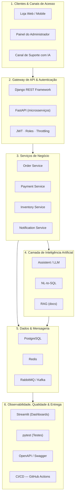

# SynapseShop — Backend de Pedidos com Inteligência Artificial


> Projeto desenvolvido no contexto da **SynapseTech** — empresa simulada do curso de
> **Programação Python Avançada com IA** (100 horas · 25 aulas).

---

## 1. Sobre o Projeto

O **SynapseShop** é o backend de uma loja online voltado à gestão de produtos, pedidos,
pagamentos simulados e notificações. Sobre essa base transacional robusta, opera uma camada
inteligente responsável por três pilares de IA:

1. **Assistente de Suporte (`/assist`)** — responde dúvidas de clientes sobre pedidos e status
   usando um serviço de IA resiliente (com *retry* e *circuit breaker*).
2. **Consulta em Linguagem Natural (`/ask_sql`)** — converte perguntas em texto corrido
   (ex.: *"quais os produtos mais vendidos este mês?"*) em consultas SQL dinâmicas.
3. **Assistente de Documentação via RAG (`/ask_docs`)** — responde com base no próprio `README`
   e na documentação técnica da API, com citação rigorosa das fontes.

O desenvolvimento segue a metodologia **SpecDD (Specification-Driven Development)**, de forma
incremental, a partir das especificações registradas em [`specs/`](specs/).

---

## 2. Equipe

| Papel | Atribuições |
| :--- | :--- |
| **Tech Lead & Product Owner** | Conduz a formação do time, define o domínio do projeto e garante o entendimento unificado da arquitetura-alvo. |
| **DevOps / SRE** | Cria e configura o repositório no GitHub, garantindo acesso e permissão de contribuição a todos os membros. |
| **Arquiteto(a)** | Planeja a arquitetura em camadas e a estrutura inicial da documentação. |
| **Desenvolvedor(a)** | Implementa o código do MVP em camadas lógicas (API, Serviços e Repositórios). |
| **Especialista em IA** | Desenha e integra os serviços de IA (assistente, texto-para-SQL e RAG). |

### Integrantes

1. Alan Correa
2. Amanda Gomes
3. Alvaro Luiz
4. Gustavo Lima
5. Ricardo Reis
6. Hiram Simoes
7. Caio Barbosa

---

## 3. Domínio da Loja

**Eletrônicos** — e-commerce de produtos eletrônicos (categorias, catálogo e gestão de pedidos),
mantendo aderência total aos requisitos técnicos obrigatórios do MVP.

---

## 4. MVP — Descrição

Backend containerizado de uma loja de **eletrônicos** com gestão de produtos, pedidos, pagamentos
simulados e notificações, exposto por APIs (Django REST Framework + FastAPI) com autenticação JWT
baseada em papéis. O MVP integra, na camada de IA, pelo menos uma das funcionalidades inteligentes
(assistente de suporte, texto-para-SQL ou RAG) e opera com mensageria assíncrona, cache e testes
automatizados.

**Critérios de conclusão (DoD global):**
- Subir o ambiente completo com um único comando: `docker-compose up`.
- Autenticação JWT com pelo menos dois papéis de usuário.
- Fluxo ponta a ponta `Pedido ➔ Pagamento ➔ Notificação` com mensageria, idempotência e DLQ.
- Testes automatizados dentro da meta da turma e documentação OpenAPI/Swagger.
- Pelo menos uma funcionalidade de IA operacional.
- Pipeline de CI/CD (GitHub Actions) e dashboard analítico (Streamlit).
- Documentação completa em Markdown, incluindo o histórico de prompts em [`PROMPTS.md`](PROMPTS.md).

---

## 5. Arquitetura-Alvo em 6 Camadas

O sistema é projetado em **6 camadas lógicas**, conteinerizadas via Docker e orquestradas com
Docker Compose:



### Descrição textual das camadas

1. **Clientes & Canais de Acesso** — Loja Web/Mobile, Painel do Administrador e Canal de Suporte com IA.
2. **Gateway de API & Autenticação** — DRF para a API principal, FastAPI para microsserviços; JWT com papéis (roles) e *throttling*.
3. **Serviços de Negócio** — *Order Service* (criação e eventos), *Payment Service* (pagamento simulado), *Inventory Service* (estoque/produtos) e *Notification Service* (consumidor de eventos).
4. **Camada de IA** — Assistente de suporte, consultas NL-to-SQL e RAG, integrados a provedores de LLM externos (OpenAI/DeepSeek).
5. **Dados & Mensageria** — PostgreSQL (relacional + migrações Alembic), Redis (cache-aside), RabbitMQ/Kafka (eventos, idempotência e DLQ).
6. **Observabilidade, Qualidade & Entrega** — Dashboards Streamlit, testes `pytest`, OpenAPI/Swagger e CI/CD com GitHub Actions.

---

## 6. Definição de Pronto — Aula 1 (Kick-off)

- [x] Repositório único do projeto criado no GitHub.
- [x] Todos os membros do time com permissão de escrita/push (colaboradores definidos na spec).
- [x] `README.md` na raiz com equipe, papéis, domínio e arquitetura-alvo em 6 camadas.
- [x] `PROMPTS.md` criado na raiz para registro do histórico de uso de IA generativa.

---

## 7. Infraestrutura (Aula 3) — Docker Compose

O ambiente é orquestrado com Docker Compose e sobe com **um único comando**:

```bash
docker-compose up
```

### Serviços

| Serviço | Imagem | Porta | Objetivo |
| :--- | :--- | :--- | :--- |
| `api` | `synapseshop:dev` (build local) | `8000` | Executa a aplicação e expõe a rota de monitoramento `/health`. |
| `postgres` | `postgres:16-alpine` | `5432` | Banco de dados relacional do MVP (dados persistidos). |

O serviço `api` recebe via variáveis de ambiente as credenciais essenciais do banco
(`POSTGRES_HOST`, `POSTGRES_PORT`, `POSTGRES_DB`, `POSTGRES_USER`, `POSTGRES_PASSWORD`).
Dados do banco são persistidos no volume `pgdata`.

### Procedimentos

- **Subir o ambiente:** `docker-compose up` (ou `docker-compose up --build -d` em modo *detached*)
- **Derrubar o ambiente:** `docker-compose down` (adicione `-v` para apagar também o volume `pgdata`)
- **Acompanhar os logs:** `docker-compose logs -f`
- **Logs de um serviço específico:** `docker-compose logs -f api` ou `docker-compose logs -f postgres`
- **Verificar a saúde da API:** `curl http://localhost:8000/health` → `{"status": "ok"}`
- **Status dos serviços:** `docker-compose ps`

A imagem utiliza **multistage build** (`builder` gera as dependências; `runtime` mantém a
imagem final enxuta), executa com **usuário não-root** e gerencia o **cache de dependências**
copiando o `requirements.txt` antes do código. No start, o contêiner aplica as migrações
(`python manage.py migrate`) e sobe o servidor de desenvolvimento do Django na porta `8000`.

---

## 8. API Principal (Aula 4) — Django REST Framework

A API principal é construída com **Django 5.2 LTS** + **Django REST Framework 3.18**, com
operações CRUD completas sob rotas versionadas em `/api/v1/`. Nesta etapa o banco é o
**SQLite** (arquivo local, sem driver extra), mantendo o escopo incremental até a modelagem
relacional da Aula 6.

### Estrutura

| Caminho | Camada | Responsabilidade |
| :--- | :--- | :--- |
| `config/` | Projeto | `settings.py`, `urls.py`, `wsgi.py`/`asgi.py`. |
| `repositories/` | Dados | App Django com os models `Category` e `Item`. |
| `api/` | API | Serializers, ViewSets, roteador e a view `/health`. |
| `services/` | Negócio | Reservado para regras de domínio (aulas futuras). |

### Endpoints

| Método | Rota | Ação | Status |
| :--- | :--- | :--- | :--- |
| GET | `/api/v1/categories/` | Lista categorias | 200 |
| POST | `/api/v1/categories/` | Cria categoria | 201 / 400 |
| GET | `/api/v1/categories/{id}/` | Detalha categoria | 200 / 404 |
| PUT/PATCH | `/api/v1/categories/{id}/` | Atualiza categoria | 200 / 400 / 404 |
| DELETE | `/api/v1/categories/{id}/` | Remove categoria | 204 / 404 |
| GET | `/api/v1/items/` | Lista itens | 200 |
| POST | `/api/v1/items/` | Cria item | 201 / 400 |
| GET | `/api/v1/items/{id}/` | Detalha item | 200 / 404 |
| PUT/PATCH | `/api/v1/items/{id}/` | Atualiza item | 200 / 400 / 404 |
| DELETE | `/api/v1/items/{id}/` | Remove item | 204 / 404 |
| GET | `/health` | Monitoramento | 200 |

O `Item` possui `name`, `description`, `price` (`Decimal`), `category` (FK) e `is_active`;
o `Category` possui `name` (único), `description` e `created_at`.

### Migrações e execução

```bash
docker-compose up --build          # aplica as migrações e sobe a API
docker-compose exec api python manage.py makemigrations   # novas migrações
docker-compose exec api python manage.py migrate          # aplicar manualmente
```

### Exemplos rápidos

```bash
curl http://localhost:8000/health

curl -X POST http://localhost:8000/api/v1/categories/ \
  -H "Content-Type: application/json" \
  -d '{"name": "Eletronicos", "description": "Produtos eletronicos"}'

curl -X POST http://localhost:8000/api/v1/items/ \
  -H "Content-Type: application/json" \
  -d '{"name": "Notebook", "price": "4999.90", "category": 1}'
```

A coleção de rotas está exportada em
[`docs/postman/SynapseShop_Aula4.postman_collection.json`](docs/postman/SynapseShop_Aula4.postman_collection.json)
para importação no Postman, e o guia de revisão de código gerado por IA está em
[`docs/CHECKLIST_IA_SAFE.md`](docs/CHECKLIST_IA_SAFE.md).

---

## 9. Documentação & Especificações

| Arquivo | Descrição |
| :--- | :--- |
| [`README.md`](README.md) | Visão geral do projeto, equipe, domínio, MVP e arquitetura. |
| [`PROMPTS.md`](PROMPTS.md) | Histórico do uso de IA generativa (prompts utilizados pela equipe). |
| [`specs/specs_da_aula_1.md`](specs/specs_da_aula_1.md) | Kick-off, formação do time e criação do repositório. |
| [`specs/specs_da_aula_2.md`](specs/specs_da_aula_2.md) | Esqueleto do projeto em camadas e conteinerização (Docker). |
| [`specs/specs_da_aula_3.md`](specs/specs_da_aula_3.md) | Docker essencial: multistage build, cache e Compose (API + banco). |
| [`specs/specs_da_aula_4.md`](specs/specs_da_aula_4.md) | CRUD da API principal com Django REST Framework. |
| [`docs/CHECKLIST_IA_SAFE.md`](docs/CHECKLIST_IA_SAFE.md) | Checklist de revisão de código gerado por IA. |
| [`docs/postman/SynapseShop_Aula4.postman_collection.json`](docs/postman/SynapseShop_Aula4.postman_collection.json) | Coleção Postman das rotas da Aula 4. |
| [`specs/PROJECT_OVERVIEW.MD`](specs/PROJECT_OVERVIEW.MD) | Visão geral do SynapseShop e trilha de entregas (25 aulas). |