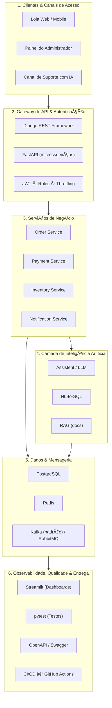

# SynapseShop — Backend de Pedidos com Inteligência Artificial


> Projeto desenvolvido no contexto da **SynapseTech** — empresa simulada do curso de
> **Programação Python Avançada com IA** (100 horas · 25 aulas).

---

## 1. Sobre o Projeto

O **SynapseShop** é o backend de uma loja online voltado à gestão de produtos, pedidos,
pagamentos simulados e notificações. Sobre essa base transacional robusta, opera uma camada
inteligente responsável por três pilares de IA:

1. **Assistente de Suporte (`/assist`)** — responde dúvidas de clientes sobre pedidos e status
   usando um serviço de IA resiliente (com *retry* e *circuit breaker*).
2. **Consulta em Linguagem Natural (`/ask_sql`)** — converte perguntas em texto corrido
   (ex.: *"quais os produtos mais vendidos este mês?"*) em consultas SQL dinâmicas.
3. **Assistente de Documentação via RAG (`/ask_docs`)** — responde com base no próprio `README`
   e na documentação técnica da API, com citação rigorosa das fontes.

O desenvolvimento segue a metodologia **SpecDD (Specification-Driven Development)**, de forma
incremental, a partir das especificações registradas em [`specs/`](specs/).

---

## 2. Equipe

| Papel | Atribuições |
| :--- | :--- |
| **Tech Lead & Product Owner** | Conduz a formação do time, define o domínio do projeto e garante o entendimento unificado da arquitetura-alvo. |
| **DevOps / SRE** | Cria e configura o repositório no GitHub, garantindo acesso e permissão de contribuição a todos os membros. |
| **Arquiteto(a)** | Planeja a arquitetura em camadas e a estrutura inicial da documentação. |
| **Desenvolvedor(a)** | Implementa o código do MVP em camadas lógicas (API, Serviços e Repositórios). |
| **Especialista em IA** | Desenha e integra os serviços de IA (assistente, texto-para-SQL e RAG). |

### Integrantes

1. Alan Correa
2. Amanda Gomes
3. Alvaro Luiz
4. Gustavo Lima
5. Ricardo Reis
6. Hiram Simoes
7. Caio Barbosa

---

## 3. Domínio da Loja

**Eletrônicos** — e-commerce de produtos eletrônicos (categorias, catálogo e gestão de pedidos),
mantendo aderência total aos requisitos técnicos obrigatórios do MVP.

---

## 4. MVP — Descrição

Backend containerizado de uma loja de **eletrônicos** com gestão de produtos, pedidos, pagamentos
simulados e notificações, exposto por APIs (Django REST Framework + FastAPI) com autenticação JWT
baseada em papéis. O MVP integra, na camada de IA, pelo menos uma das funcionalidades inteligentes
(assistente de suporte, texto-para-SQL ou RAG) e opera com mensageria assíncrona, cache e testes
automatizados.

**Critérios de conclusão (DoD global):**
- Subir o ambiente completo com um único comando: `docker-compose up`.
- Autenticação JWT com pelo menos dois papéis de usuário.
- Fluxo ponta a ponta `Pedido ➔ Pagamento ➔ Notificação` com mensageria, idempotência e DLQ.
- Testes automatizados dentro da meta da turma e documentação OpenAPI/Swagger.
- Pelo menos uma funcionalidade de IA operacional.
- Pipeline de CI/CD (GitHub Actions) e dashboard analítico (Streamlit).
- Documentação completa em Markdown, incluindo o histórico de prompts em [`PROMPTS.md`](PROMPTS.md).

---

## 5. Arquitetura-Alvo em 6 Camadas

O sistema é projetado em **6 camadas lógicas**, conteinerizadas via Docker e orquestradas com
Docker Compose:


```mermaid
flowchart TB
    subgraph C1["1. Clientes & Canais de Acesso"]
        A1["Loja Web / Mobile"]
        A2["Painel do Administrador"]
        A3["Canal de Suporte com IA"]
    end

    subgraph C2["2. Gateway de API & Autenticação"]
        B1["Django REST Framework"]
        B2["FastAPI (microsserviços)"]
        B3["JWT · Roles · Throttling"]
    end

    subgraph C3["3. Serviços de Negócio"]
        D1["Order Service"]
        D2["Payment Service"]
        D3["Inventory Service"]
        D4["Notification Service"]
    end

    subgraph C4["4. Camada de Inteligência Artificial"]
        E1["Assistent / LLM"]
        E2["NL-to-SQL"]
        E3["RAG (docs)"]
    end

    subgraph C5["5. Dados & Mensageria"]
        F1["PostgreSQL"]
        F2["Redis"]
        F3["Kafka (padrão) / RabbitMQ"]
    end

    subgraph C6["6. Observabilidade, Qualidade & Entrega"]
        G1["Streamlit (Dashboards)"]
        G2["pytest (Testes)"]
        G3["OpenAPI / Swagger"]
        G4["CI/CD — GitHub Actions"]
    end

    C1 --> C2 --> C3 --> C4
    C3 --> C5
    C4 --> C5
    C5 --> C6
```

### Descrição textual das camadas

1. **Clientes & Canais de Acesso** — Loja Web/Mobile, Painel do Administrador e Canal de Suporte com IA.
2. **Gateway de API & Autenticação** — DRF para a API principal, FastAPI para microsserviços; JWT com papéis (roles) e *throttling*.
3. **Serviços de Negócio** — *Order Service* (criação e eventos), *Payment Service* (pagamento simulado), *Inventory Service* (estoque/produtos) e *Notification Service* (consumidor de eventos).
4. **Camada de IA** — Assistente de suporte, consultas NL-to-SQL e RAG, integrados a provedores de LLM externos (OpenAI/DeepSeek).
5. **Dados & Mensageria** — PostgreSQL (relacional + migrações Alembic), Redis (cache-aside), Kafka (eventos, idempotência e DLQ) com RabbitMQ como broker alternativo.
6. **Observabilidade, Qualidade & Entrega** — Dashboards Streamlit, testes `pytest`, OpenAPI/Swagger e CI/CD com GitHub Actions.

---

## 6. Definição de Pronto — Aula 1 (Kick-off)

- [x] Repositório único do projeto criado no GitHub.
- [x] Todos os membros do time com permissão de escrita/push (colaboradores definidos na spec).
- [x] `README.md` na raiz com equipe, papéis, domínio e arquitetura-alvo em 6 camadas.
- [x] `PROMPTS.md` criado na raiz para registro do histórico de uso de IA generativa.

---

## 7. Infraestrutura (Aula 3) — Docker Compose

O ambiente é orquestrado com Docker Compose e sobe com **um único comando**:

```bash
docker-compose up
```

### Serviços

| Serviço | Imagem | Porta | Objetivo |
| :--- | :--- | :--- | :--- |
| `api` | `synapseshop:dev` (build local) | `8000` | Executa a aplicação e expõe a rota de monitoramento `/health`. |
| `inventory` | `synapseshop-inventory:dev` (build local) | `8100` | Microsserviço de estoque em FastAPI (Aulas 5–6), com `/docs` e persistência em PostgreSQL via Alembic. |
| `pedido-worker` | `synapseshop:dev` (build local) | — | Consumidor da Camada 5 (Aulas 9–10). Escalável com `--scale`. |
| `postgres` | `postgres:16-alpine` | `5432` | Banco de dados relacional do MVP (dados persistidos). |
| `redis` | `redis:7-alpine` | `6379` | Cache-aside do catálogo, deduplicação e contadores de métricas, com política `allkeys-lru` e volume `redisdata`. |
| `kafka` | `apache/kafka:3.9.1` | `9092` / `29092` | Broker de eventos (KRaft single-node, Aula 10). `9092` para o host, `29092` para a rede Compose. |
| `rabbitmq` | `rabbitmq:3-management` | `5672` / `15672` | Broker alternativo (Aula 9), com UI de gerenciamento. |

O serviço `api` recebe via variáveis de ambiente as credenciais do banco
(`POSTGRES_HOST`, `POSTGRES_PORT`, `POSTGRES_DB`, `POSTGRES_USER`, `POSTGRES_PASSWORD`)
e conecta no serviço `postgres` pelo hostname interno `postgres`, aguardando o
`service_healthy` antes de subir. Dados do banco são persistidos no volume `pgdata`.

Desde a **Aula 8** a API também depende do serviço `redis` (`REDIS_URL`,
`CACHE_ENABLED`, `CACHE_TTL_LISTA`, `CACHE_TTL_DETALHE`), aguardando o
`service_healthy` do Redis. Se o Redis ficar indisponível, a API continua
respondendo a partir do PostgreSQL (`IGNORE_EXCEPTIONS=True`) e o header
`X-Cache` passa a reportar `BYPASS`.

Desde a **Aula 9** a API e o `pedido-worker` publicam e consomem eventos. Desde a
**Aula 10** o broker padrão é o serviço `kafka` (KRaft, sem ZooKeeper), com
`service_healthy` antes de qualquer consumidor subir. Os dois brokers ficam de pé
no Compose; qual está ativo é a variável `MENSAGERIA_BROKER`.

### Procedimentos

- **Subir o ambiente:** `docker-compose up` (ou `docker-compose up --build -d` em modo *detached*)
- **Derrubar o ambiente:** `docker-compose down` (adicione `-v` para apagar também o volume `pgdata`)
- **Acompanhar os logs:** `docker-compose logs -f`
- **Logs de um serviço específico:** `docker-compose logs -f api` ou `docker-compose logs -f postgres`
- **Verificar a saúde da API:** `curl http://localhost:8000/health` → `{"status": "ok"}`
- **Status dos serviços:** `docker-compose ps`

A imagem utiliza **multistage build** (`builder` gera as dependências; `runtime` mantém a
imagem final enxuta), executa com **usuário não-root** e gerencia o **cache de dependências**
copiando o `requirements.txt` antes do código. No start, o contêiner aplica as migrações
(`python manage.py migrate`), cria os usuários demo para autenticação
(`python manage.py seed_demo_users`, Aula 7) e sobe o servidor de desenvolvimento do Django
na porta `8000`.

---

## 8. API Principal (Aula 4) — Django REST Framework

A API principal é construída com **Django 5.2 LTS** + **Django REST Framework 3.18**, com
operações CRUD completas sob rotas versionadas em `/api/v1/`. Desde a **Aula 7** o banco é o
**PostgreSQL** do Compose (driver `psycopg` 3), o mesmo do microsserviço `inventory` e com
persistência no volume `pgdata`. Nas Aulas 4–6 a API operava sobre SQLite, escopo agora
superado.

> **A partir da Aula 7,** todos os endpoints de `/api/v1/` exigem autenticação JWT
> (leitura) e os endpoints de escrita exigem o papel `admin` — ver a
> [Seção 9](#9-autenticação-jwt-papéis-e-throttling-aula-7).

### Estrutura

| Caminho | Camada | Responsabilidade |
| :--- | :--- | :--- |
| `config/` | Projeto | `settings.py`, `urls.py`, `wsgi.py`/`asgi.py`. |
| `repositories/` | Dados | App Django com os models `User` (papéis Aula 7), `Category` e `Item`. |
| `api/` | API | Serializers, ViewSets, roteador e a view `/health`. |
| `services/` | Negócio | Reservado para regras de domínio (aulas futuras). |

### Endpoints

| Método | Rota | Ação | Status |
| :--- | :--- | :--- | :--- |
| GET | `/api/v1/categories/` | Lista categorias | 200 / 401 |
| POST | `/api/v1/categories/` | Cria categoria (admin) | 201 / 400 / 401 / 403 |
| GET | `/api/v1/categories/{id}/` | Detalha categoria | 200 / 404 / 401 |
| PUT/PATCH | `/api/v1/categories/{id}/` | Atualiza categoria (admin) | 200 / 400 / 401 / 403 / 404 |
| DELETE | `/api/v1/categories/{id}/` | Remove categoria (admin) | 204 / 401 / 403 / 404 |
| GET | `/api/v1/items/` | Lista itens | 200 / 401 |
| POST | `/api/v1/items/` | Cria item (admin) | 201 / 400 / 401 / 403 |
| GET | `/api/v1/items/{id}/` | Detalha item | 200 / 404 / 401 |
| PUT/PATCH | `/api/v1/items/{id}/` | Atualiza item (admin) | 200 / 400 / 401 / 403 / 404 |
| DELETE | `/api/v1/items/{id}/` | Remove item (admin) | 204 / 401 / 403 / 404 |
| GET | `/health` | Monitoramento | 200 |

O `Item` possui `name`, `description`, `price` (`Decimal`), `category` (FK) e `is_active`;
o `Category` possui `name` (único), `description` e `created_at`.

### Migrações e execução

```bash
docker-compose up --build          # aplica as migrações e sobe a API
docker-compose exec api python manage.py makemigrations   # novas migrações
docker-compose exec api python manage.py migrate          # aplicar manualmente
```

### Exemplos rápidos

```bash
curl http://localhost:8000/health

curl -X POST http://localhost:8000/api/v1/categories/ \
  -H "Content-Type: application/json" \
  -d '{"name": "Eletronicos", "description": "Produtos eletronicos"}'

curl -X POST http://localhost:8000/api/v1/items/ \
  -H "Content-Type: application/json" \
  -d '{"name": "Notebook", "price": "4999.90", "category": 1}'
```

A coleção de rotas está exportada em
[`docs/postman/SynapseShop_Aula4.postman_collection.json`](docs/postman/SynapseShop_Aula4.postman_collection.json)
para importação no Postman, e o guia de revisão de código gerado por IA está em
[`docs/CHECKLIST_IA_SAFE.md`](docs/CHECKLIST_IA_SAFE.md).

---

## 9. Autenticação JWT, Papéis e Throttling (Aula 7)

A camada de acesso seguro da API principal usa **JWT stateless** (Bearer) com **dois
papéis** (`admin` e `user`), **throttling** contra força bruta e **paginação/filtros**
nos endpoints críticos. Tudo configurável via variáveis de ambiente
(`JWT_*`, `THROTTLE_*`, `SEED_*` — ver [Seção 14](#14-variáveis-de-ambiente)).

### Usuários e papéis

O modelo de usuário é customizado (`repositories.User`, sobre `AbstractUser`) e persistido
em **PostgreSQL**, na tabela `repositories_user` do mesmo banco do `inventory`. O
comando `python manage.py seed_demo_users` — executado no start do container — cria,
de forma idempotente, dois usuários demo a partir das envs `SEED_*`:

| Usuário | Papel | Credenciais default |
| :--- | :--- | :--- |
| `admin` | `admin` (acesso total) | `admin` / `admin` |
| `user` | `user` (somente leitura) | `user` / `user` |

### Fluxos de autenticação

| Método | Rota | Ação | Status |
| :--- | :--- | :--- | :--- |
| POST | `/api/v1/auth/token/` | Login → `{access, refresh, role}` | 200 / 401 / 429 |
| POST | `/api/v1/auth/token/refresh/` | Renova o access token | 200 / 401 / 429 |

O token (access e refresh) carrega a claim `role`, permitindo ao cliente controlar a
interface sem chamadas extras. Defaults: access 60 min, refresh 7 dias.

### Proteção das rotas administrativas

- **Leitura** (`GET` list/detail) de `/api/v1/categories/` e `/api/v1/items/`: exige
  **autenticação** (qualquer papel) → sem token retorna **401**.
- **Escrita** (`POST`/`PUT`/`PATCH`/`DELETE`): exige o papel **`admin`** → usuário comum
  autenticado retorna **403**.
- `/health` permanece **público** (monitoramento).

### Throttling e segurança mínima

| Escopo | Onde se aplica | Default |
| :--- | :--- | :--- |
| `anon` | endpoints DRF sem autenticação | `20/min` |
| `user` | endpoints DRF autenticados | `200/min` |
| `login` | `POST /api/v1/auth/token/*` (anti força bruta) | `5/min` |

Exaurida a taxa de `login`, o servidor responde **429 Too Many Requests** antes mesmo de
validar credenciais.

### Paginação e filtros nos endpoints críticos

- Paginação por **página numerada**: `{count, next, previous, results}` com
  `page_size` default de **10** e ajuste via `?page_size=`.
- **Busca** (`?search=`), **ordenação** (`?ordering=`) e filtros por **query param**:
  `is_active`, `category` em `/api/v1/items/`.

### Exemplos rápidos

```bash
# Login admin (guarde o access token)
curl -X POST http://localhost:8000/api/v1/auth/token/ \
  -H "Content-Type: application/json" \
  -d '{"username": "admin", "password": "admin"}'

# Rotas protegidas: leitura exige Bearer
curl http://localhost:8000/api/v1/categories/ \
  -H "Authorization: Bearer <access_token>"

# Escrita exige papel admin; usuário comum recebe 403
curl -X POST http://localhost:8000/api/v1/categories/ \
  -H "Authorization: Bearer <access_token>" \
  -H "Content-Type: application/json" \
  -d '{"name": "Eletronicos", "description": "Produtos eletronicos"}'

# Paginação e filtros nos itens
curl "http://localhost:8000/api/v1/items/?search=Notebook&is_active=true&page_size=5" \
  -H "Authorization: Bearer <access_token>"
```

Evidências e decisões em
[`docs/DECISOES_TECNICAS_AULA7.md`](docs/DECISOES_TECNICAS_AULA7.md) e
[`docs/METRICAS_AULA7.md`](docs/METRICAS_AULA7.md), com a coleção Postman em
[`docs/postman/SynapseShop_Aula7.postman_collection.json`](docs/postman/SynapseShop_Aula7.postman_collection.json).

---

## 10. Microsserviço de Inventário — FastAPI (Aulas 5 e 6)

Microsserviço complementar de estoque (`inventory`) construído com **FastAPI**,
conteinerizado separadamente e orquestrado pelo mesmo `docker-compose`. Desde a
**Aula 6** o estado é persistido no **PostgreSQL** com mapeamento via
**SQLAlchemy 2.0** e **migrações versionadas com Alembic** (a autenticação JWT
fica na Aula 7 — escopo SpecDD preservado).

### Estrutura

| Caminho | Responsabilidade |
| :--- | :--- |
| `inventory/app/main.py` | Aplicação FastAPI, `/health` e raiz com informações do serviço. |
| `inventory/app/schemas.py` | Modelos Pydantic (contratos de entrada, saída e validações). |
| `inventory/app/db.py` | SQLAlchemy: `engine`, `Base`, `SessionLocal` e dependency `get_session()`. |
| `inventory/app/models.py` | Modelo ORM `InventoryItem` (índices essenciais e integridade). |
| `inventory/app/repository.py` | `InventoryRepository` — persistência transacional (commit/rollback). |
| `inventory/app/services.py` | `InventoryService` — regras de domínio sobre o repositório. |
| `inventory/app/routes.py` | Rotas do inventário sob `/inventory/items`. |
| `inventory/migrations/` | Migrações Alembic (`versions/0001_create_inventory_items.py`). |
| `inventory/scripts/` | Smoke test e teste transacional com coleta de tempos. |
| `inventory/Dockerfile` | Imagem com multistage build e usuário não-root (porta `8100`). |

### Endpoints

| Método | Rota | Ação | Status |
| :--- | :--- | :--- | :--- |
| GET | `/health` | Monitoramento | 200 |
| GET | `/inventory/items` | Lista itens de estoque | 200 |
| POST | `/inventory/items` | Cria item de estoque | 201 / 400 / 409 |
| GET | `/inventory/items/{id}/` | Detalha item | 200 / 404 |
| PATCH | `/inventory/items/{id}/` | Atualiza item | 200 / 404 / 409 |
| PATCH | `/inventory/items/{id}/stock` | Ajusta estoque (transação) | 200 / 404 / 409 |
| DELETE | `/inventory/items/{id}/` | Remove item | 204 / 404 |

A **documentação automática (OpenAPI/Swagger)** está disponível em
`http://localhost:8100/docs`.

### Migrações de schema (Alembic + PostgreSQL)

Aplicadas automaticamente no start do contêiner (`alembic upgrade head`).
Manualmente, dentro do contêiner:

```bash
docker compose exec inventory alembic current          # revisão corrente
docker compose exec inventory alembic history          # histórico de revisões
docker compose exec inventory alembic upgrade head     # aplica pendentes
docker compose exec inventory alembic downgrade -1     # rollback de 1 revisão
```

O modelo relacional (`inventory_items`) contempla índices essenciais
(`sku` único e `name`) e integridade relacional (`NOT NULL`, `sku` único e
`CheckConstraint quantity >= 0`). Detalhes em
[`docs/DECISOES_TECNICAS_AULA6.md`](docs/DECISOES_TECNICAS_AULA6.md) e métricas
em [`docs/METRICAS_AULA6.md`](docs/METRICAS_AULA6.md).

### Exemplos rápidos

```bash
curl http://localhost:8100/health
curl http://localhost:8100/docs

curl -X POST http://localhost:8100/inventory/items \
  -H "Content-Type: application/json" \
  -d '{"sku": "NB-001", "name": "Notebook 16GB", "quantity": 10}'

curl http://localhost:8100/inventory/items
curl http://localhost:8100/inventory/items/1

# Ajuste transacional de estoque
curl -X PATCH http://localhost:8100/inventory/items/1/stock \
  -H "Content-Type: application/json" \
  -d '{"delta": -2}'
```

O padrão de prompts de IA da squad está definido em
[`PROMPTS-TEMPLATE.md`](PROMPTS-TEMPLATE.md), com registro no
[`PROMPTS.md`](PROMPTS.md).

---

## 11. Cache-aside com Redis (Aula 8)

O catálogo passou a ser servido por **cache-aside com Redis** (`django-redis`),
com TTL, invalidação por eventos de domínio, header `X-Cache` e métricas de hit
rate. O microsserviço `inventory` permanece intocado.

### Estrutura

| Caminho | Responsabilidade |
| :--- | :--- |
| `services/cache.py` | Cache-aside, assinatura de chaves, TTL, índices de invalidação, métricas e logs. |
| `services/events.py` | Dispatcher in-process de eventos de domínio (`emitir`/`registrar`). |
| `services/cache_invalidation.py` | Ligação evento do domínio → chaves de cache a invalidar. |
| `api/views.py` | Cache nos endpoints de itens e `CacheStatsView`. |
| `api/apps.py` | `ready()` registra os handlers de invalidação. |
| `repositories/management/commands/seed_demo_catalog.py` | Catálogo de 5 categorias e 300 itens para medição. |
| `scripts/bench_cache.py` | Benchmark de latência (média, p50, p95) e RPS. |
| `scripts/smoke_test_cache.py` | Verificação de miss/hit, TTL, invalidação e métricas. |

### Chaves e TTL

| Chave Redis (após `KEY_PREFIX`) | Conteúdo | TTL |
| :--- | :--- | ---: |
| `synapseshop:1:itens:list:<assinatura>` | página da listagem já paginada | 60 s |
| `synapseshop:1:item:<id>` | item único já serializado | 300 s |
| `itens:list:indice` / `itens:detalhe:indice` | *sets* de chaves ativas, para invalidação | — |

A listagem é cacheada por **assinatura**: SHA-1 de 12 caracteres dos query params
relevantes (`search`, `ordering`, `category`, `is_active`, `min_price`,
`max_price`, `page`, `page_size`) ordenados e normalizados, para que filtros
diferentes nunca compartilhem a mesma chave.

### Estratégia de invalidação

A invalidação é orientada a **eventos de domínio**, não a tempo. Cada escrita
emite um evento **após o commit** no PostgreSQL (`transaction.on_commit`), e o
handler apaga as chaves afetadas:

| Evento | Invalida |
| :--- | :--- |
| `ItemCriado` / `ItemAtualizado` / `ItemRemovido` | `item:<id>` e todas as `itens:list:*` |
| `CategoryCriada` / `CategoryAtualizada` / `CategoryRemovida` | `item:<id>` e todas as `itens:list:*` |

Pontos-chave da estratégia:

- **`on_commit`:** sem ele, um rollback invalidaria o cache com o dado ainda no
  banco, produzindo uma leitura inconsistente.
- **Índice em *set*:** as chaves de listagem são registradas em
  `itens:list:indice`, então a invalidação faz 1 `SMEMBERS` + `DEL` do conjunto,
  sem `SCAN` nem `KEYS` sobre o keyspace.
- **Falha isolada:** handler com `try/except` — evento de domínio nunca derruba
  a requisição de escrita. Se o handler falhar, o log registra `handler_falhou`
  e o TTL assume como rede de segurança.
- **Sem broker:** dispatcher in-process, conforme a restrição SpecDD (Kafka e
  RabbitMQ são das aulas 9-11). `emitir()` é o ponto de extensão futuro.

### Endpoints de métricas

| Método | Rota | Ação | Acesso |
| :--- | :--- | :--- | :--- |
| GET | `/api/v1/cache/stats/` | Hit rate por endpoint e global | admin |
| POST | `/api/v1/cache/stats/` | Zera os contadores | admin |

```json
{
  "cache_habilitado": true,
  "endpoints": {
    "itens:list":  {"hits": 40, "misses": 1, "total_lookups": 41, "hit_rate": 0.9756, "ttl_segundos": 60},
    "item:detalhe": {"hits": 25, "misses": 1, "total_lookups": 26, "hit_rate": 0.9615, "ttl_segundos": 300}
  },
  "total_hits": 65, "total_misses": 2, "total_lookups": 67, "hit_rate": 0.9701
}
```

### Observabilidade

Header `X-Cache` em toda resposta de item: `HIT`, `MISS` ou `BYPASS` (cache
desativado). Logs estruturados JSON:

```json
{"evento": "cache.lookup", "endpoint": "itens:list", "chave": "itens:list:c846376af757", "resultado": "MISS", "ttl": 60, "origem": "postgresql"}
{"evento": "dominio.emitido", "nome": "ItemAtualizado", "payload": {"item_id": 110}}
```

### Desempenho medido

Catálogo de 300 itens, par A/B na **mesma imagem** alternando apenas
`CACHE_ENABLED`, 150 requisições com concorrência 1:

| Endpoint | Média sem cache | Média com cache | Variação | RPS sem | RPS com | Variação |
| :--- | ---: | ---: | ---: | ---: | ---: | ---: |
| Listagem `?page_size=10` | 22,01 ms | **15,48 ms** | **−29,7 %** | 45,32 | **64,42** | **+42,1 %** |
| Detalhe `/api/v1/items/310/` | 24,08 ms | **17,07 ms** | **−29,1 %** | 41,44 | **58,43** | **+41,0 %** |

Ciclo de vida observado em tempo real: `MISS` → `HIT` → (60 s) `MISS` por
expiração de TTL, e `HIT` → `MISS` logo após um `PATCH`, por evento de domínio.
A decomposição do custo por requisição e as ressalvas de variância estão em
[`docs/METRICAS_AULA8.md`](docs/METRICAS_AULA8.md); as decisões e alternativas
consideradas em [`docs/DECISOES_TECNICAS_AULA8.md`](docs/DECISOES_TECNICAS_AULA8.md).

### Exemplos rápidos

```bash
# Popula o catálogo de medição (idempotente)
docker compose exec -T api python manage.py seed_demo_catalog

# Ciclo miss -> hit na listagem (X-Cache na resposta)
curl -i "http://localhost:8000/api/v1/items/?page_size=10" -H "Authorization: Bearer <access_token>"
curl -i "http://localhost:8000/api/v1/items/?page_size=10" -H "Authorization: Bearer <access_token>"

# Invalidação: o PATCH invalida item:<id> e todas as listas
curl -X PATCH "http://localhost:8000/api/v1/items/110/" \
  -H "Authorization: Bearer <access_token>" -H "Content-Type: application/json" \
  -d '{"name":"Item alterado"}'
curl -i "http://localhost:8000/api/v1/items/110/" -H "Authorization: Bearer <access_token>"

# Métricas de hit rate (admin)
curl -X POST "http://localhost:8000/api/v1/cache/stats/" -H "Authorization: Bearer <access_token>"
curl "http://localhost:8000/api/v1/cache/stats/" -H "Authorization: Bearer <access_token>"

# Chaves e TTL no Redis
docker compose exec -T redis redis-cli -n 1 --scan --pattern 'synapseshop:1:*'
docker compose exec -T redis redis-cli -n 1 SMEMBERS "itens:list:indice"
docker compose exec -T redis redis-cli -n 1 TTL "synapseshop:1:item:110"

# Benchmark (antes/despues, o --path vai no caminho da listagem ou do detalhe)
python scripts/bench_cache.py --path "/api/v1/items/?page_size=10" --requests 150 --concurrency 1

# Kill-switch: desliga o cache sem mexer no código (X-Cache passa a BYPASS)
# CACHE_ENABLED=false docker compose up -d --force-recreate api

# Verificação funcional
python scripts/smoke_test_cache.py
```

### Operação

| Comandos | Efeito |
| :--- | :--- |
| `docker compose exec -T redis redis-cli -n 1 FLUSHALL` | Limpa cache e contadores |
| `docker compose exec -T redis redis-cli -n 1 INFO memory` | Memória usada pelo Redis |
| `docker compose logs -f api` | Logs estruturados `cache.lookup` e `dominio.emitido` |

Quando `CACHE_ENABLED=false`, o backend passa a `LocMemCache` e o header
`X-Cache` responde `BYPASS` — a API segue funcionando, sem cache.

> **Nota:** com o cache no Redis, os contadores do throttling do DRF (Aula 7)
> passaram a viver no Redis. Ganho de consistência entre workers, com a
> consequência de que o estado sobrevive a reinícios até expirar a janela.

---

## 12. Mensageria Assíncrona — Kafka (Camada 5)

O fluxo de pedidos é assíncrono: a API grava o pedido e publica o evento
`PedidoCriado` num broker; um *worker* dedicado consome a fila, processa a
mensagem e persiste o estado no repositório. Reentregas são tratadas por
**idempotência**, recuo exponencial e, em último caso, **Dead Letter Queue**.

O broker padrão é o **Kafka** (Aula 10). O **RabbitMQ** da Aula 9 continua
funcionando atrás da mesma fachada — a escolha de broker é uma variável de
ambiente, e ambos passam no mesmo smoke test.

### Kafka ou RabbitMQ

| Critério | Kafka (padrão) | RabbitMQ (alternativo) |
| :--- | :--- | :--- |
| Paralelismo de consumo | por partição do tópico | por consumidor da fila |
| Retenção | nativa, por tópico | limitada a filas duráveis |
| Reentrega com contagem | header `x-retry-count` na republicação | *nack requeue* / DLX nativa |
| Rota de falha | tópico DLQ explícito | *dead-letter exchange* da fila |
| Ordem | por partição (chave = `idempotency_key`) | por fila (*round-robin*) |

O contrato em `events/contracts.py` traz `event_type` e `version`, então a troca
de broker não quebra o formato da mensagem. A decisão e o porquê de cada escolha
estão em [`docs/DECISOES_TECNICAS_AULA10.md`](docs/DECISOES_TECNICAS_AULA10.md).

### Topologia do Kafka

```
   POST /api/v1/pedidos/ ──▶-key: idempotency_key─▶┌───────────────────────┐
                                                   │  pedidos.pedidocriado │
                                                   │  3 partições          │
                                                   │  retenção 7 dias      │
                                                   └───────────┬───────────┘
                                                               │ consumer group
                                                               │ pedido-worker
                                                    ┌──────────▼───────────┐
                                                    │  pedido-worker       │  PENDENTE → PROCESSANDO
                                                    │  commit manual       │  (síncrono, após o efeito)
                                                    └──────────┬───────────┘
                                          falhas esgotadas   │
                                                    ┌──────────▼───────────┐
                                                    │ pedidos.pedidocriado │  ← inspeção
                                                    │        .dlq          │    manual
                                                    │  1 partição          │
                                                    │  retenção 28 dias    │
                                                    └──────────────────────┘
```

| Elemento | Configuração | Observação |
| :--- | :--- | :--- |
| `pedidos.pedidocriado` | 3 partições, retenção `604800000` ms | Eventos de `PedidoCriado`. |
| `pedidos.pedidocriado.dlq` | 1 partição, retenção `2419200000` ms | Mensagens mortas, para inspeção. |
| `pedido-worker` | consumer group | Um consumidor por partição. |
| Chave de partição | `idempotency_key` | Eventos do mesmo pedido ficam na mesma partição, em ordem. |
| Réplicas | `KAFKA_REPLICAS=1` | Broker único no Compose; subir em cluster. |

A topologia é **declarada pela aplicação** (`declarar_topologia()`, via
`AdminClient`), de forma idempotente: producer e consumer chamam a mesma função
na subida, e `TOPIC_ALREADY_EXISTS` é sucesso. Assim não existe passo de setup
manual que alguém esqueça.

### Listeners

O mesmo broker atende duas redes:

| Listener | Endereço | Quem usa |
| :--- | :--- | :--- |
| Compose | `kafka:29092` | Containers (`api`, `pedido-worker`). |
| Host | `localhost:9092` | Scripts rodados na máquina de desenvolvimento. |

Os dois são texto puro, sem TLS — adequado à stack local. Para o host, os
scripts precisam de `KAFKA_BOOTSTRAP_SERVERS=localhost:9092`, porque o default
de `config/settings.py` também é `localhost` e o do Compose é `kafka:29092`.


### Contrato da mensagem `PedidoCriado`

Definido e **validado** em `events/contracts.py`. O envelope JSON:

```json
{
  "event_id": "0f3c...uuid",
  "event_type": "PedidoCriado",
  "version": "1.0",
  "occurred_at": "2026-09-30T23:52:29.117970Z",
  "correlation_id": "b7a1...uuid",
  "idempotency_key": "pedido-2026-0001",
  "dados": {
    "pedido_id": 15,
    "usuario_id": 2,
    "total": "399.80",
    "status": "PENDENTE",
    "itens": [
      {"item_id": 622, "quantidade": 2, "preco_unitario": "199.90"}
    ]
  }
}
```

Regras de contrato:

- **Discriminantes** — `event_type` e `version` são validados na recepção; evento
  desconhecido ou de versão incompatível é rejeitado **antes** de qualquer escrita.
- **`idempotency_key`** — chave de negócio do pedido, **obrigatória**, até 64
  caracteres (limite do índice único). É o que garante idempotência ponta a ponta.
- **Monetário como `str`** — `total` e `preco_unitario` viajam como texto; `float`
  no JSON introduz erro de arredondamento.
- **`correlation_id`** — identificador que atravessa produtor e consumidor,
  permitindo correlacionar logs e mensagens.
- **Preço congelado** — o cliente informa apenas `item_id` e `quantidade`; preço
  e total são calculados no servidor a partir do catálogo, para que o evento
  descreva o pedido como foi vendido.

### Idempotência

Duas camadas, com a mesma chave e o mesmo TTL:

| Camada | Onde | Papel |
| :--- | :--- | :--- |
| `EventoProcessado` (PostgreSQL) | `services/idempotencia.py` | Fonte durável; unicidade `(evento, idempotency_key)` resolve corrida entre consumidores. |
| Redis (`evento:processado:<evento>:<chave>`) | mesmo módulo | Caminho rápido, com TTL nativo. |

Pontos-chave da regra:

- **No produtor** — repetir a mesma `idempotency_key` devolve o **mesmo pedido**
  com **200**, sem criar outro e sem publicar outro evento.
- **No consumidor** — a chave é registrada **depois** do processamento
  bem-sucedido, nunca antes: reservar a chave antes descartaria uma reentrega cujo
  processamento falhou, entregando o pedido com efeito zero.
- **TTL** — `IDEMPOTENCIA_TTL_SEGUNDOS` (padrão 24 h). As chaves expiradas são
  removidas na subida do worker para a tabela não crescer sem limite.
- **Efeito idempotente** — a transição `PENDENTE` → `PROCESSANDO` só ocorre se o
  pedido ainda estiver `PENDENTE`, então mesmo uma corrida de reentregas não
  duplica o efeito.

### Reentrega, recuo e DLQ

| Parâmetro | Default | Significado |
| :--- | ---: | :--- |
| `MENSAGERIA_MAX_RETRIES` | `3` | Reentregas **além** da primeira tentativa (4 tentativas no total). |
| `MENSAGERIA_BACKOFF_BASE_MS` | `250` | Base do recuo exponencial. |
| `MENSAGERIA_BACKOFF_MAX_MS` | `5000` | Teto do recuo. |
| `RABBITMQ_PREFETCH` | `1` | Uma mensagem por vez; nada se perde em requeue (só no RabbitMQ). |

A contagem de tentativas atravessa o broker em headers, e não em memória do
processo — é isso que permite a reentrega continuar de onde parou.

1. Sucesso → confirma o offset (`commit` síncrono, **depois** do efeito gravado).
2. Falha com `tentativa < MAX_RETRIES` → republica o mesmo corpo em
   `pedidos.pedidocriado` com `x-retry-count` incrementado, aguarda o recuo
   exponencial (`250 ms → 500 ms → 1000 ms → …`, limitado por `BACKOFF_MAX`) e
   então confirma a original.
3. `tentativa >= MAX_RETRIES` → publica em `pedidos.pedidocriado.dlq` com o erro
   em `x-ultimo-erro` e confirma a original. Não há consumo automático da DLQ: a
   decisão de reprocessar é humana.

No RabbitMQ, os mesmos passos usam `ack` manual, *nack requeue* para a reentrega
e *dead-letter exchange* para a DLQ.

Corpo ilegível (JSON inválido) não tem como ser reprocessado e vai direto para a
DLQ, sem consumir tentativas.

### Estrutura

| Caminho | Responsabilidade |
| :--- | :--- |
| `events/contracts.py` | Contrato `PedidoCriado` (serialização e validação). |
| `services/messaging.py` | Fachada: escolhe o broker a partir de `MENSAGERIA_BROKER`. |
| `services/messaging_kafka.py` | Topologia, produtor, consumidor com offset manual, reentrega e DLQ. |
| `services/messaging_rabbit.py` | Mesmo contrato sobre RabbitMQ (broker alternativo). |
| `services/idempotencia.py` | Chave de deduplicação com TTL (Redis + PostgreSQL). |
| `api/views.py` | `PedidoCreateView` (produtor) e `PedidoDetailView` (observabilidade). |
| `workers/pedido_worker.py` | Consumidor: valida o contrato, deduplica e persiste o estado. |
| `scripts/smoke_test_mensageria.py` | Verificação do fluxo, da idempotência e da DLQ em ambos os brokers. |
| `scripts/bench_mensageria.py` | Latência ponta a ponta, percentis e throughput de consumo. |


### Endpoints

| Método | Rota | Ação | Status |
| :--- | :--- | :--- | :--- |
| POST | `/api/v1/pedidos/` | Cria pedido e publica `PedidoCriado` | 201 / 200 / 400 / 401 |
| GET | `/api/v1/pedidos/{id}/` | Detalha pedido (dono ou admin) | 200 / 404 |

A criação do pedido exige autenticação (qualquer papel) — diferentemente do
catálogo, em que escrita é `admin`-only, porque o pedido pertence a quem o cria.

`201` traz `evento_publicado: true`. Se o pedido for commitado mas o broker
recusar o evento, a resposta é `202` com `evento_publicado: false`: o dado está no
banco e a falha fica registrada em log, sem mentir sobre o estado.

### Observabilidade

Logs estruturados JSON com `duracao_ms` em cada etapa:

```json
{"evento": "mensageria.publicado", "idempotency_key": "pedido-smoke-1790812348", "duracao_ms": 3.91}
{"evento": "mensageria.consumido", "idempotency_key": "pedido-smoke-1790812348", "resultado": "ok", "duracao_ms": 12.4}
{"evento": "worker.pedido.duplicado", "pedido_id": 15, "resultado": "duplicado", "duracao_ms": 0.35}
{"evento": "mensageria.reentrega", "tentativa": 0, "proxima_tentativa": 1, "espera_ms": 250.0}
{"evento": "mensageria.dlq", "tentativa": 3, "dlq": "pedidos.pedidocriado.dlq"}
```

### Exemplos rápidos

```bash
# Token e criação do pedido (o evento é publicado no mesmo passo)
TOKEN=$(curl -s -X POST http://localhost:8000/api/v1/auth/token/ \
  -H "Content-Type: application/json" -d '{"username":"user","password":"user"}' \
  | python -c "import sys,json;print(json.load(sys.stdin)['access'])")

curl -X POST http://localhost:8000/api/v1/pedidos/ \
  -H "Authorization: Bearer $TOKEN" -H "Content-Type: application/json" \
  -d '{"idempotency_key":"pedido-2026-0001","itens":[{"item_id":1,"quantidade":2}]}'

# O worker leva o pedido de PENDENTE para PROCESSANDO
curl http://localhost:8000/api/v1/pedidos/15/ -H "Authorization: Bearer $TOKEN"

# Repetir a chave devolve o mesmo pedido, com 200
curl -i -X POST http://localhost:8000/api/v1/pedidos/ \
  -H "Authorization: Bearer $TOKEN" -H "Content-Type: application/json" \
  -d '{"idempotency_key":"pedido-2026-0001","itens":[{"item_id":1,"quantidade":2}]}'

# Logs de produtor e consumidor
docker compose logs -f api pedido-worker

# UI de gerenciamento do RabbitMQ (broker alternativo; guest/guest)
# http://localhost:15672

# Estado dos tópicos do Kafka
docker compose exec -T kafka /opt/kafka/bin/kafka-topics.sh --bootstrap-server localhost:29092 --list
docker compose exec -T kafka /opt/kafka/bin/kafka-consumer-groups.sh --bootstrap-server localhost:29092 --describe --group pedido-worker
```

### Operação

| Comando | Efeito |
| :--- | :--- |
| `PEDIDO_WORKER_FALHA_IDEM_KEYS="pedido-dlq-*" docker compose up -d --force-recreate pedido-worker` | Worker rejeita pedidos cujo padrão casa — simula erro para validar reentrega/DLQ |
| `MENSAGERIA_BROKER=rabbitmq docker compose up -d --force-recreate api pedido-worker` | Alterna para o broker da Aula 9 |
| `MENSAGERIA_BROKER=kafka docker compose up -d --force-recreate api pedido-worker` | Volta ao Kafka |
| `docker compose up -d --scale pedido-worker=3 pedido-worker` | Escala o consumo (1 consumidor por partição) |
| `docker compose exec -T kafka ... --delete --topic pedidos.pedidocriado.dlq` | Remove a DLQ depois da inspeção |
| `docker compose exec -T rabbitmq rabbitmqctl purge_queue pedidos.pedidocriado.dlq` | Limpa a DLQ do RabbitMQ |
| `docker compose exec -T rabbitmq rabbitmqctl list_queues name messages` | Estado das filas do RabbitMQ |
| `docker compose logs -f pedido-worker` | Logs do consumidor |
| `MESSAGERIA_ENABLED=false docker compose up -d --force-recreate api` | Kill-switch: grava o pedido sem publicar (202) |

Com `MESSAGERIA_ENABLED=false` a API segue funcionando: o pedido é persistido e
a resposta é `202` com `evento_publicado: false`, o que isola o custo da
sincronia ponta a ponta em medições.

### Verificação funcional

O smoke test é o mesmo nos dois brokers — ele detecta o broker ativo por
`MENSAGERIA_BROKER` e adapta as verificações de partição/DLQ.

```bash
# Fluxo feliz + idempotência (o cenário de DLQ é pulado sem o modo forçado)
python scripts/smoke_test_mensageria.py

# Com o cenário de DLQ ativo
PEDIDO_WORKER_FALHA_IDEM_KEYS="pedido-dlq-*" docker compose up -d --force-recreate pedido-worker
python scripts/smoke_test_mensageria.py
```

Resultado da validação:

| Broker | Resultado | Verificações extras |
| :--- | :--- | :--- |
| Kafka | **25 PASS / 0 FAIL** | Mesma chave sempre na mesma partição; chaves diferentes se espalham pelas 3 partições |
| RabbitMQ | **23 PASS / 0 FAIL** | — |

Ambos cobrem publicação, contrato, consumo com persistência do estado,
idempotência no produtor, idempotência na reentrega (o teste republica o mesmo
evento) e chegada à DLQ com o pedido ainda em `PENDENTE`.

### Desempenho medido

Medido com `scripts/bench_mensageria.py` sobre o caminho real. Números,
ambiente e limites desta medição em
[`docs/METRICAS_AULA10.md`](docs/METRICAS_AULA10.md).

| Cenário | 1 consumidor | 3 consumidores |
| :--- | :--- | :--- |
| Produção em rajada (200 pedidos) | 11,18 req/s | 11,15 req/s |
| Latência ponta a ponta p50 / p95 | 64,69 / 67,23 ms | 64,62 / 68,04 ms |
| Latência ponta a ponta p99 | 68,30 ms | 71,72 ms |
| Backlog de 1000 msgs drenado | 66,31 msg/s | 80,56 msg/s |

O gargalo da produção é a API (cada `POST` custa ~89 ms, com publicação
síncrona e `acks=all`), não o consumidor: um worker já acompanha a taxa de 11
req/s. Escalar o consumo só se pagaria com um produtor mais rápido que o serial.

```bash
# Latência ponta a ponta com o worker no ar
python scripts/bench_mensageria.py --modo api --pedidos 200 --rotulo "kafka-1-consumidor"

# Teto de consumo: enche o backlog com o worker parado, depois mede a queda
docker compose stop pedido-worker
python scripts/bench_mensageria.py --modo drenagem --fase preencher --pedidos 1000
python scripts/bench_mensageria.py --modo drenagem --fase medir --espera 300
```

> **Nota:** o harness é tolerante ao throttle da API (200/min): aguarda a janela
> expirar uma vez e segue, em vez de descartar da amostra os pedidos lentos, que
> são justamente a cauda dos percentis.


---

## 13. Testes Automatizados (Aula 12)

Suíte `pytest` organizada em `tests/unit` (ramos felizes e de erro, parametrizados)
e `tests/integration` (ciclo de vida completo dos recursos na API), com cobertura
global mínima de **85%** (.coveragerc). A execução atual mede **99,91%** do código
aplicacional de `services`, `events`, `api`, `config` e `repositories`.

### Execução

```bash
python -m pytest                       # suíte completa (unit + integration)
python -m pytest tests/unit            # somente unitários
python -m pytest tests/integration     # somente integração
pytest --cov --cov-report=term-missing # relatório detalhado linha a linha
```

O `pytest.ini` já define `DJANGO_SETTINGS_MODULE=config.settings_test`
(`config/settings_test.py`): SQLite em memória, `LocMemCache` (`CACHE_ENABLED=True`),
`MESSAGERIA_ENABLED=False`, hashers MD5 e throttle elevado — a suíte evita
dependências externas (PostgreSQL, Redis, broker). No container, a mesma suíte
roda com `docker-compose exec api pytest --cov`.

### O que a suíte prova

| Camada | Cobertura |
| :--- | :--- |
| `events/contracts.py` · `events/topology.py` | Contratos: serialização, validação e topologia — 100%. |
| `services/cache.py` · `services/cache_invalidation.py` | Cache-aside com `FakeRedis`, TTL, invalidação por eventos, métricas e falhas do Redis — 100%. |
| `services/events.py` · `services/idempotencia.py` | Dispatcher in-process e deduplicação com falha de Redis caindo no PostgreSQL. |
| `services/pagamento.py` · `services/notificacao.py` | Pedido ➔ Pagamento ➔ Notificação: idempotência, corridas e publicação — 100%. |
| `services/health.py` · `services/publicacao.py` · `services/messaging.py` | Healthchecks (PostgreSQL/Redis/broker) e fachada de transporte (kafka/rabbitmq/rejeição). |
| `api/*` | Serializers (validações), permissões, filtros, paginação, auth JWT e cache stats — 99–100%. |
| `repositories/models.py` · seeds | Models e comandos `seed_demo_users` / `seed_demo_catalog` — 100%. |

As barras e o estado realista aparecem com `--cov term-missing`; a meta de
85% é imposta por `[report] fail_under` no `.coveragerc`.

### Escopo da medição

A cobertura mede o código de aplicação. Ficam de fora, de propósito
(documentado em `.coveragerc`): migrações, `__init__`, `config/settings*.py`,
pontas WSGI/ASGI e os **transportes de broker**
(`services/messaging_kafka.py`, `services/messaging_rabbit.py`), que exigem um
broker real no ar e por isso são exercitados pelo smoke test do Compose (Aula 10).

---

## 14. Variáveis de ambiente

A configuração dos serviços é feita por variáveis de ambiente. O `docker-compose.yml`
interpola essas variáveis (`${VAR}`) a partir do arquivo `.env` da raiz do projeto e injeta
os valores nos contêineres. Para começar:

```bash
cp .env.example .env
```

O `.env` **não é versionado** (ver `.gitignore`/`.dockerignore`); o `.env.example` é o
modelo versionado com todas as variáveis. Todos os valores têm default em `:-` no compose,
então o ambiente também sobe sem `.env` (com os valores de dev).

| Variável | Default | Consumida por |
| :--- | :--- | :--- |
| `DJANGO_SECRET_KEY` | `dev-insecure-synapseshop-change-me` | `api` (`config/settings.py`) |
| `DJANGO_DEBUG` | `true` | `api` (`config/settings.py`) |
| `JWT_ACCESS_TOKEN_MINUTES` | `60` | `api` (`config/settings.py` — lifetime do access JWT) |
| `JWT_REFRESH_TOKEN_DAYS` | `7` | `api` (`config/settings.py` — lifetime do refresh JWT) |
| `THROTTLE_ANON` | `20/min` | `api` (`config/settings.py` — throttling de não autenticados) |
| `THROTTLE_USER` | `200/min` | `api` (`config/settings.py` — throttling de autenticados) |
| `THROTTLE_LOGIN` | `5/min` | `api` (`config/settings.py` — throttling do login/token) |
| `REDIS_URL` | `redis://redis:6379/1` (Compose) · `redis://localhost:6379/1` (código) | `api` (`config/settings.py` — cache e throttling) |
| `CACHE_ENABLED` | `true` | `api` (`config/settings.py` — kill-switch do cache-aside) |
| `CACHE_TTL_LISTA` | `60` | `api` (`config/settings.py` — TTL da listagem em segundos) |
| `CACHE_TTL_DETALHE` | `300` | `api` (`config/settings.py` — TTL do detalhe em segundos) |
| `CACHE_TTL_PEDIDO` | `60` | `api`, `pedido-worker`, `notificacao-worker` (`config/settings.py` — TTL do detalhe do pedido, Aula 11) |
| `RABBITMQ_HOST` | `rabbitmq` (Compose) · `localhost` (código) | `api`, `pedido-worker`, `notificacao-worker` |
| `RABBITMQ_PORT` | `5672` | `api`, `pedido-worker` |
| `RABBITMQ_USER` / `RABBITMQ_PASSWORD` | `guest` / `guest` | `api`, `pedido-worker` |
| `RABBITMQ_VHOST` | `/` | `api`, `pedido-worker` |
| `MENSAGERIA_BROKER` | `kafka` | `api`, `pedido-worker`, `notificacao-worker` — broker ativo (`kafka` ou `rabbitmq`) |
| `MENSAGERIA_ENABLED` | `true` | `api` (`config/settings.py` — kill-switch da publicação) |
| `KAFKA_BOOTSTRAP_SERVERS` | `localhost:9092` (código) · `kafka:29092` (Compose) | `api`, `pedido-worker`, scripts |
| `KAFKA_TOPICO_PEDIDO_CRIADO` | `pedidos.pedidocriado` | `api`, `pedido-worker` |
| `KAFKA_TOPICO_PEDIDO_CRIADO_DLQ` | `pedidos.pedidocriado.dlq` | `api`, `pedido-worker` |
| `KAFKA_TOPICO_PAGAMENTO_PROCESSADO` | `pagamentos.pagamentoprocessado` | `api`, `notificacao-worker` (Aula 11) |
| `KAFKA_TOPICO_PAGAMENTO_PROCESSADO_DLQ` | `pagamentos.pagamentoprocessado.dlq` | `api`, `notificacao-worker` (Aula 11) |
| `KAFKA_TOPICO_NOTIFICACAO_ENVIADA` | `notificacoes.notificacaoenviada` | `api`, `notificacao-worker` (Aula 11) |
| `KAFKA_TOPICO_NOTIFICACAO_ENVIADA_DLQ` | `notificacoes.notificacaoenviada.dlq` | `api`, `notificacao-worker` (Aula 11) |
| `KAFKA_GRUPO_NOTIFICACAO` | `notificacao-worker` | `notificacao-worker` (Aula 11) |
| `KAFKA_PARTICOES` | `3` | `api`, `pedido-worker`, `notificacao-worker` (paralelismo de consumo) |
| `KAFKA_REPLICAS` | `1` | `api`, `pedido-worker` (1 = broker único) |
| `KAFKA_RETENTION_MS` | `604800000` (7 dias) | `api`, `pedido-worker` |
| `KAFKA_CLEANUP_POLICY` | `delete` | `api`, `pedido-worker` |
| `KAFKA_GRUPO_CONSUMIDORES` | `pedido-worker` | `pedido-worker` |
| `KAFKA_AUTO_OFFSET_RESET` | `earliest` | `pedido-worker` |
| `KAFKA_PRODUCER_ACKS` | `all` | `api`, `pedido-worker` |
| `KAFKA_PRODUCER_LINGER_MS` | `5` | `api`, `pedido-worker` |
| `KAFKA_POLL_TIMEOUT_S` | `1.0` | `pedido-worker` |
| `KAFKA_SESSION_TIMEOUT_MS` | `10000` | `pedido-worker` |
| `KAFKA_MAX_POLL_INTERVAL_MS` | `300000` | `pedido-worker` |
| `IDEMPOTENCIA_TTL_SEGUNDOS` | `86400` | `api`, `pedido-worker` (janela de deduplicação) |
| `MENSAGERIA_MAX_RETRIES` | `3` | `pedido-worker` (reentregas além da 1ª tentativa) |
| `MENSAGERIA_BACKOFF_BASE_MS` | `250` | `pedido-worker` (base do recuo exponencial) |
| `MENSAGERIA_BACKOFF_MAX_MS` | `5000` | `pedido-worker` (teto do recuo) |
| `RABBITMQ_PREFETCH` | `1` | `pedido-worker` (mensagens em voo por consumidor) |
| `RABBITMQ_FILA_PAGAMENTO_PROCESSADO` / `RABBITMQ_FILA_PAGAMENTO_PROCESSADO_DLQ` | `pagamentos.pagamentoprocessado` / `pagamentos.pagamentoprocessado.dlq` | `api`, `notificacao-worker` (Aula 11) |
| `RABBITMQ_FILA_NOTIFICACAO_ENVIADA` / `RABBITMQ_FILA_NOTIFICACAO_ENVIADA_DLQ` | `notificacoes.notificacaoenviada` / `notificacoes.notificacaoenviada.dlq` | `api`, `notificacao-worker` (Aula 11) |
| `RABBITMQ_ROUTING_KEY_PAGAMENTO_PROCESSADO` | `pagamento.processado` | `api`, `notificacao-worker` (Aula 11) |
| `RABBITMQ_ROUTING_KEY_NOTIFICACAO_ENVIADA` | `notificacao.enviada` | `api`, `notificacao-worker` (Aula 11) |
| `PEDIDO_WORKER_FALHA_IDEM_KEYS` | (vazio) | `pedido-worker` (padrões `fnmatch` de `idempotency_key` para simular erro) |
| `NOTIFICACAO_WORKER_FALHA_IDEM_KEYS` | (vazio) | `notificacao-worker` (padrões `fnmatch` para simular erro — aceita `pedido:<id>` ou `pagamento:<id>`) |
| `LOG_LEVEL_SYNAPSESHOP` | `INFO` | `api`, `pedido-worker` (nível dos logs estruturados) |
| `SEED_ADMIN_USERNAME` / `SEED_ADMIN_PASSWORD` / `SEED_ADMIN_EMAIL` | `admin` / `admin` / `admin@synapseshop.local` | `api` (`seed_demo_users`) |
| `SEED_USER_USERNAME` / `SEED_USER_PASSWORD` / `SEED_USER_EMAIL` | `user` / `user` / `user@synapseshop.local` | `api` (`seed_demo_users`) |
| `POSTGRES_DB` | `synapseshop` | `postgres`, `api`, `inventory` |
| `POSTGRES_USER` | `synapseshop` | `postgres`, `api`, `inventory` |
| `POSTGRES_PASSWORD` | `synapseshop` | `postgres`, `api`, `inventory` |
| `POSTGRES_HOST` | `postgres` (Compose) · `localhost` (código) | `api`, `inventory` |
| `POSTGRES_PORT` | `5432` | `api`, `inventory` |
| `DATABASE_URL` | (vazio) | `inventory` (prioridade sobre `POSTGRES_*`) |

> **Fora do Docker:** os serviços mantêm defaults de código (`config/settings.py` e
> `inventory/app/db.py` apontam para `localhost:5432/synapseshop`; `config/settings.py` usa a
> secret de dev), ou exporte as variáveis manualmente no seu shell. Para rodar a API Django
> fora do Compose é preciso um PostgreSQL acessível em `localhost:5432` — a instalação do
> driver é `pip install -r requirements.txt` (inclui `psycopg[binary]`). Não há dependência
> de `python-dotenv` — o `.env` é de responsabilidade do Docker Compose.

---

## 15. Documentação & Especificações

| Arquivo | Descrição |
| :--- | :--- |
| [`README.md`](README.md) | Visão geral do projeto, equipe, domínio, MVP e arquitetura. |
| [`PROMPTS.md`](PROMPTS.md) | Histórico do uso de IA generativa (prompts utilizados pela equipe). |
| [`specs/specs_da_aula_1.md`](specs/specs_da_aula_1.md) | Kick-off, formação do time e criação do repositório. |
| [`specs/specs_da_aula_2.md`](specs/specs_da_aula_2.md) | Esqueleto do projeto em camadas e conteinerização (Docker). |
| [`specs/specs_da_aula_3.md`](specs/specs_da_aula_3.md) | Docker essencial: multistage build, cache e Compose (API + banco). |
| [`specs/specs_da_aula_4.md`](specs/specs_da_aula_4.md) | CRUD da API principal com Django REST Framework. |
| [`specs/specs_da_aula_5.md`](specs/specs_da_aula_5.md) | Microsserviço de inventário em FastAPI. |
| [`specs/specs_da_aula_6.md`](specs/specs_da_aula_6.md) | Modelagem relacional, índices e migrações (Alembic). |
| [`specs/specs_da_aula_7.md`](specs/specs_da_aula_7.md) | Autenticação JWT com papéis e throttling. |
| [`docs/DECISOES_TECNICAS_AULA6.md`](docs/DECISOES_TECNICAS_AULA6.md) | Decisões técnicas da Aula 6. |
| [`docs/METRICAS_AULA6.md`](docs/METRICAS_AULA6.md) | Tempos de execução das transações (Aula 6). |
| [`docs/DECISOES_TECNICAS_AULA7.md`](docs/DECISOES_TECNICAS_AULA7.md) | Decisões técnicas da Aula 7. |
| [`docs/METRICAS_AULA7.md`](docs/METRICAS_AULA7.md) | Evidências de autenticação/throttling/acesso (Aula 7). |
| [`specs/specs_da_aula_8.md`](specs/specs_da_aula_8.md) | Cache-aside com Redis, TTL e invalidação por eventos. |
| [`docs/DECISOES_TECNICAS_AULA8.md`](docs/DECISOES_TECNICAS_AULA8.md) | Decisões técnicas de chaves, TTL e invalidação (Aula 8). |
| [`docs/METRICAS_AULA8.md`](docs/METRICAS_AULA8.md) | Latência, RPS, hit rate e ciclo de vida do cache (Aula 8). |
| [`specs/specs_da_aula_9.md`](specs/specs_da_aula_9.md) | Mensageria assíncrona e filas com RabbitMQ. |
| [`docs/DECISOES_TECNICAS_AULA9.md`](docs/DECISOES_TECNICAS_AULA9.md) | Decisões de broker, contrato, idempotência e política de falha (Aula 9). |
| [`docs/METRICAS_AULA9.md`](docs/METRICAS_AULA9.md) | Tempos de execução, tentativas e evidências da DLQ (Aula 9). |
| [`specs/specs_da_aula_10.md`](specs/specs_da_aula_10.md) | Kafka na Camada 5: partições, offsets manuais, reentrega, DLQ e métricas. |
| [`docs/DECISOES_TECNICAS_AULA10.md`](docs/DECISOES_TECNICAS_AULA10.md) | Decisões de topologia, partições, commit, idempotência e DLQ (Aula 10). |
| [`docs/METRICAS_AULA10.md`](docs/METRICAS_AULA10.md) | Latência ponta a ponta, throughput de consumo e efeito do paralelismo (Aula 10). |
| [`specs/specs_da_aula_11.md`](specs/specs_da_aula_11.md) | Pedido → Pagamento → Notificação com eventos, cache do pedido e healthchecks. |
| [`docs/DECISOES_TECNICAS_AULA11.md`](docs/DECISOES_TECNICAS_AULA11.md) | Decisões da Aula 11: contratos, topologia, cache, DLQ e fluxo completo. |
| [`docs/METRICAS_AULA11.md`](docs/METRICAS_AULA11.md) | Evidências do fluxo completo, cache, idempotência e DLQ (Aula 11). |
| [`specs/specs_da_aula_12.md`](specs/specs_da_aula_12.md) | Suíte de testes: unitários parametrizados, integração do ciclo de vida e meta de cobertura. |
| [`pytest.ini`](pytest.ini) · [`.coveragerc`](.coveragerc) · [`config/settings_test.py`](config/settings_test.py) | Infraestrutura da suíte de testes (settings, fakes e escopo de cobertura). |
| [`.env.example`](.env.example) | Modelo versionado das variáveis de ambiente. |
| [`PROMPTS-TEMPLATE.md`](PROMPTS-TEMPLATE.md) | Template padrão de prompts de IA da squad. |
| [`docs/CHECKLIST_IA_SAFE.md`](docs/CHECKLIST_IA_SAFE.md) | Checklist de revisão de código gerado por IA. |
| [`docs/postman/SynapseShop_Aula4.postman_collection.json`](docs/postman/SynapseShop_Aula4.postman_collection.json) | Coleção Postman das rotas da Aula 4. |
| [`docs/postman/SynapseShop_Aula7.postman_collection.json`](docs/postman/SynapseShop_Aula7.postman_collection.json) | Coleção Postman da Aula 7 (login, sucesso, erro e acesso negado). |
| [`specs/PROJECT_OVERVIEW.MD`](specs/PROJECT_OVERVIEW.MD) | Visão geral do SynapseShop e trilha de entregas (25 aulas). |

## 14. Documentação da API (Aula 13)

- **Contrato OpenAPI**: [openapi.yaml](openapi.yaml) na raiz (OpenAPI 3.0.3).
- **Interfaces interativas**: /docs/ (Swagger UI) e /docs/redoc/ (ReDoc), servidas via CDN sem drf-spectacular.
- **Specs e diretrizes**: [specs/specs_da_aula_13.md](specs/specs_da_aula_13.md), [specs/00_diretriz_incremental_specdd.md](specs/00_diretriz_incremental_specdd.md).
- **Documentação técnica**: [docs/CONVENCOES_API.md](docs/CONVENCOES_API.md), [docs/CHECKLIST_INTEGRADOR_EXTERNO.md](docs/CHECKLIST_INTEGRADOR_EXTERNO.md), [docs/OPENAPI.md](docs/OPENAPI.md), [CHANGELOG.md](CHANGELOG.md).
- **Postman**: [docs/postman/SynapseShop_Aula13.postman_collection.json](docs/postman/SynapseShop_Aula13.postman_collection.json), [docs/postman/SynapseShop_Aula7.postman_collection.json](docs/postman/SynapseShop_Aula7.postman_collection.json), environment [docs/postman/SynapseShop_Local.postman_environment.json](docs/postman/SynapseShop_Local.postman_environment.json).

**Headers de contrato**: Authorization: Bearer <token>, Idempotency-Key (alternativa a idempotency_key no corpo), X-Trace-Id (propagado como correlation_id e ecoado).

**Erros**: padrão RFC 7807 (pplication/problem+json) com esquema Problem. Paginação page/page_size, filtros search/is_active/category, ordenação ordering.
